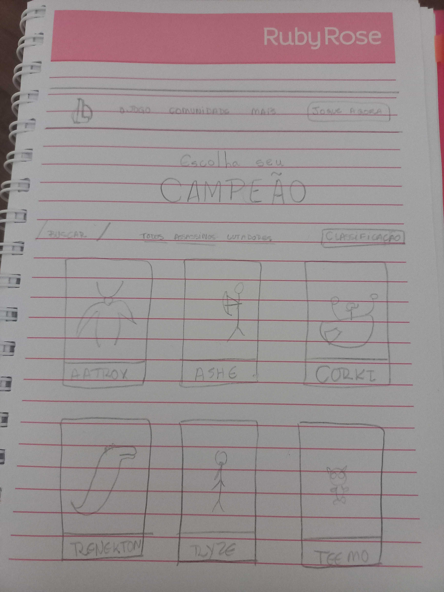
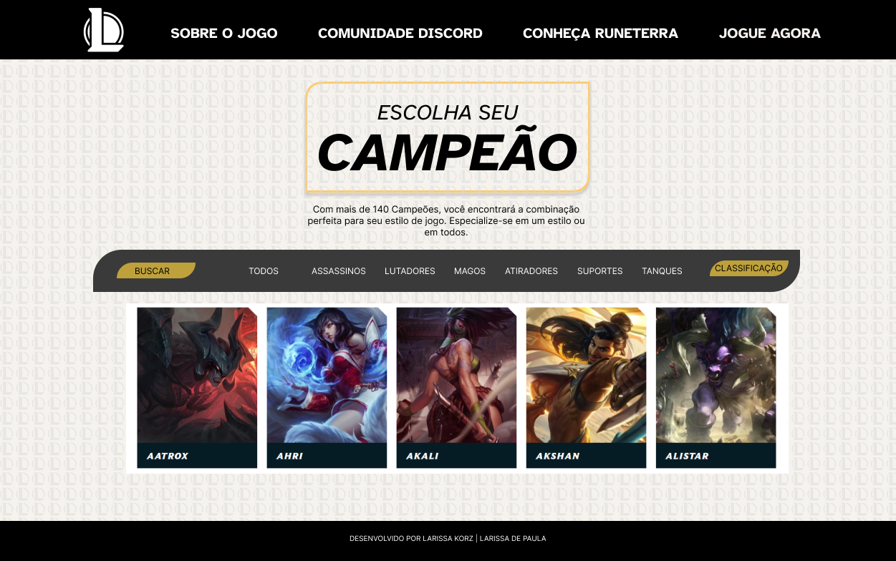

# Data Lovers -  LEAGUE OF LEGENDS

## Índice

* [1. Resumo do projeto]()
* [2. Protótipo]()
* [3. Usuários e Necessidades do Usuário]()
* [4. Instruções de Uso]()
* [5. Histórias de Usuário]()

## 1. Resumo do Projeto

Este projeto consiste no desenvolvimento de uma página web que serve como um inventário dos campeões do jogo League of Legends (LoL). O objetivo é fornecer aos usuários informações sobre as habilidades e funções de cada campeão, permitindo que eles conheçam melhor o jogo e façam escolhas estratégicas.

## 2.Protótipo

Durante o processo de desenvolvimento, foram criados protótipos de baixa e alta fidelidade para visualizar a interface do usuário e testar sua usabilidade. As iterações e os rascunhos do protótipo podem ser encontrados nas imagens a seguir:

## 3.Usuários e Necessidades do Usuário

Os usuários-alvo desse projeto são os jogadores de League of Legends que desejam obter informações detalhadas sobre os campeões do jogo. Suas principais necessidades são:

* Conhecer as habilidades de cada campeão.
* Compreender a função de cada campeão.
* Identificar as características e atributos de cada campeão.
* Encontrar campeões específicos por nome.
* Filtrar os campeões por função (lutador, atirador, mago, assassino, tanque, suporte).
* Ordenar os campeões por critérios como ataque, defesa, magia e dificuldade.

## 4.Instruções de Uso

Para utilizar o inventário dos campeões de League of Legends, siga as instruções abaixo:

* Acesse a página web do inventário dos campeões.
* Utilize a barra de busca para pesquisar um campeão por nome.
* Utilize o menu de filtragem para selecionar uma função específica de campeão.
* Utilize o menu de seleção para ordenar os campeões de acordo com um critério específico.
* Explore as informações apresentadas sobre cada campeão, incluindo suas habilidades, atributos e função.

## 5.Histórias de Usuário:

1.Como jogador interessado em conhecer os campeões do jogo League of Legends, gostaria de poder visualizar uma lista de campeões para conhecer suas habilidades e funções.
 *Critérios de Aceitação:
   [ ]A lista de campeões deve ser exibida na tela.
   [ ]Cada campeão deve ser apresentado com seu nome e imagem.
   [ ]Ao clicar em um campeão, as informações detalhadas do mesmo devem ser exibidas.

2.Como jogador que deseja explorar os campeões de uma categoria específica, gostaria de poder filtrar os campeões por função (lutador, atirador, mago, assassino, tanque, suporte).
 *Critérios de Aceitação:
   [ ]Deve haver um menu de filtros com as opções de função.
   [ ]Ao selecionar uma função, a lista de campeões deve ser atualizada para exibir apenas os campeões correspondentes à função selecionada.

3.Como jogador que deseja encontrar um campeão específico, gostaria de poder pesquisar pelo nome do campeão na lista.
 *Critérios de Aceitação:
   [ ]Deve haver um campo de pesquisa onde o jogador possa digitar o nome do campeão.
   [ ]Ao digitar o nome do campeão, a lista de campeões deve ser atualizada para exibir apenas os campeões cujo nome corresponde à pesquisa.

4.Como jogador que deseja ter uma visão geral das estatísticas dos campeões, gostaria de visualizar um gráfico com a distribuição dos campeões por função.
 *Critérios de Aceitação:
   [ ]Deve ser exibido um gráfico mostrando a porcentagem de campeões em cada função.

5.Como jogador que utiliza dispositivos móveis, gostaria que o site fosse responsivo para que eu possa acessá-lo em diferentes tamanhos de tela.
 *Critérios de Aceitação:
   [ ]O site deve ser visualizado corretamente em dispositivos móveis, como smartphones e tablets.
   [ ]Todos os elementos da página devem se adaptar ao tamanho da tela de forma adequada.

6.Como jogador que valoriza a experiência visual, gostaria que a interface do usuário fosse atraente e seguisse os fundamentos de design visual.
 *Critérios de Aceitação:
   [ ]A interface do usuário deve ser estéticamente agradável e seguir uma identidade visual consistente.
   [ ]Deve ser aplicado um design visualmente atraente aos elementos da página, como botões, menus e cartões de campeões.
